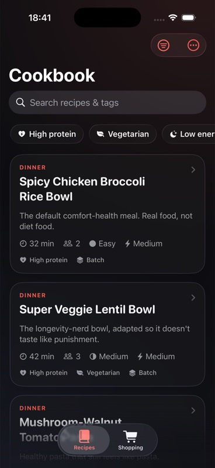
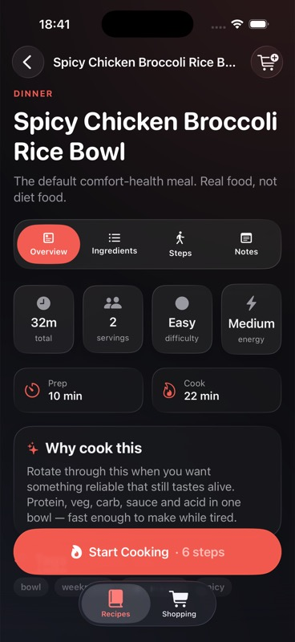
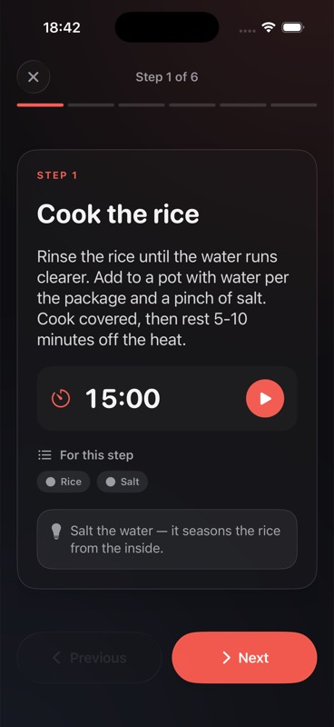
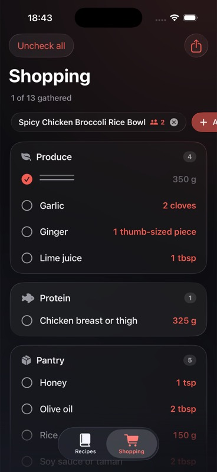

# Personal Cookbook

A local-first iOS app for the handful of healthy meals you actually cook on repeat. Built in SwiftUI with a premium, Liquid Glass–inspired dark interface — and **no images anywhere**. Richness comes entirely from layout, typography, materials, motion, and metadata.

It's designed for the real use case: choosing something to cook while tired, seeing the ingredients clearly, and following the steps one card at a time without reading a wall of text.

## Screenshots

| Library | Recipe detail | Cooking mode | Shopping list |
| :-----: | :-----------: | :----------: | :-----------: |
|  |  |  |  |

## Features

- **Recipe library** — glassy cards with name, total time, servings, difficulty, energy level, and dietary flags (high-protein, vegetarian, batch-friendly). Search plus quick filters and a full filter sheet (category, time, difficulty, diet, low-energy).
- **Recipe detail** — tabbed into *Overview · Ingredients · Steps · Notes* instead of one blob of text. Grouped ingredients, live **serving scaling**, taste fixes, easy upgrades, batch notes, and safety notes.
- **Cooking mode** — a focused, glanceable, one-step-at-a-time flow: big step title, short instruction, the ingredients and tips for that step, a built-in **timer** when a step has a duration, segmented progress, and a completion screen.
- **Shopping list** — generated from selected recipes and serving counts, with duplicate ingredients merged and grouped by aisle (Produce, Protein, Pantry, Dairy, Frozen, Spices, Other). Check items off and share the list as text.
- **JSON debug screen** — a developer-only view (from the library's overflow menu) to inspect, import, export, and validate the recipe JSON with readable error messages.

## Design

Modern Apple-style dark UI built on real **iOS 26 Liquid Glass** (`glassEffect`, `GlassEffectContainer`, glass button styles). A single warm coral-red accent is used sparingly; everything else stays monochrome so it never looks like a rainbow. No recipe photos, thumbnails, icons-as-art, or remote images.

## Data

Recipes live in a bundled [`recipes.json`](PersonalCookbook/Resources/recipes.json) and are decoded with `Codable`. No backend, no login, no network — the app works fully offline. Edit the JSON (or use the in-app debug screen) to add your own recipes.

📄 **Full field-by-field reference: [`docs/RECIPE_FORMAT.md`](docs/RECIPE_FORMAT.md)** — types, defaults, enum values, scaling/shopping behaviour, and examples.

### Model

```
Recipe          id, name, description, whyCookThis, category,
                prepTimeMinutes, cookTimeMinutes, servings,
                difficulty, energyLevel, batchFriendly, vegetarian,
                highProtein, tags, ingredientGroups, steps,
                tasteFixes, easyUpgrades, batchNotes, safetyNotes
IngredientGroup name, ingredients
Ingredient      name, amount, unit, note, optional, shoppingCategory
CookingStep     title, instruction, durationMinutes, ingredients, tips
TasteFix        problem, fix
```

## Project structure

```
PersonalCookbook/
  App/            PersonalCookbookApp.swift
  Models/         Models.swift
  Store/          RecipeStore.swift, ShoppingList.swift
  Helpers/        ScalingHelpers.swift, ShoppingListHelpers.swift
  DesignSystem/   Theme.swift, Components.swift
  Views/          LibraryView, FilterSheet, DetailView,
                  CookingModeView, ShoppingListView, JSONDebugView, RootView
  Resources/      recipes.json
```

## Building

Requires Xcode 26+ (targets iOS 26).

The Xcode project is generated from [`project.yml`](project.yml) with [XcodeGen](https://github.com/yonaskolb/XcodeGen). The committed `PersonalCookbook.xcodeproj` can be opened directly; if you change `project.yml`, regenerate it:

```sh
xcodegen generate
```

Then open `PersonalCookbook.xcodeproj` and run on an iOS 26 simulator.

## License

MIT
